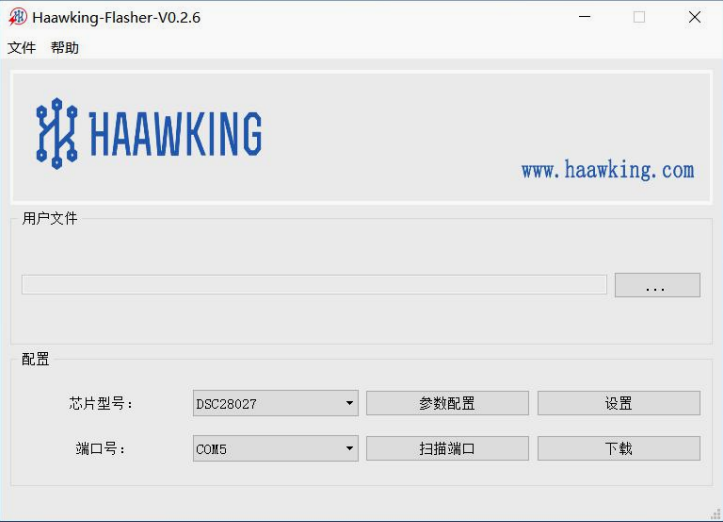

============
Haawking Flasher
============

Haawking-Flasher .exe 需要使用支持文件，不能将 Haawking-Flasher .exe 文件剪切出该文件夹，如需移至桌面或其他位置，请创建快捷方式。Haawking-Flasher .exe 的烧写文件需要使用 Haawking-IDE 的 Flash 工程 生成的文件，如使用其他或 RAM 的文件不能进行正确烧写。如电脑的特殊软件将 烧写文件修改，也不能正确烧写。

IDE
============

 

Features
============
Only Support New Version HX2000 Chips(202107 or later)

Update Logs
============
V0.1.2 
 初稿。 
V0.2.0 
 增加对 windows xp 的支持。
V0.2.1 
 增加芯片内部信息的显示。 
V0.2.2 
 增加 hex 文件解析失败提示。 
V0.2.5 
 修改 Boot 文件烧写方式，读写一帧数据的长度由 200byte 改为 1byte，稳定 烧写。
V0.2.6 
 修改 Boot 文件烧写方式，读写一帧数据的长度改为用户可修改。
 将 config.ini 设置信息放在界面上设置。
 增加芯片擦除失败报警。
 增加超长连续 地址分段处理。
V0.2.7 
 修改对 HX28034 的支持 
V0.2.8 
 增加快捷键的支持，密码区隐藏
