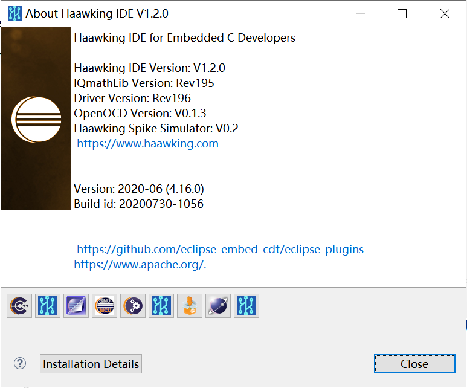

============
Haawking Flasher
============

Haawking™ IDE now provides the RISC-V DSP development market with one toolset using a single debugger instance to program and debug any of Beijing Haakwing Technology Co., Ltd's RISC-V DSPs using JTAG or HX-LINK debug interfaces.

IDE
============

Features
============
Only Support New Version HX2000 Chips(202107 or later)

Update Logs
============
更新IQMath函数库，补全乘法以及类型转换的相关函数

更新驱动库

默认使用stdlib库文件

更新027和034外设寄存器json文件
