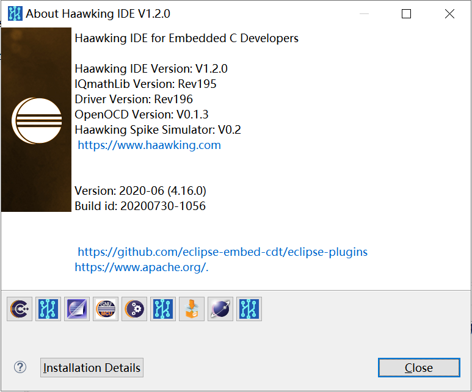

============
Haawking IDE
============

Haawking™ IDE now provides the RISC-V DSP development market with one toolset using a single debugger instance to program and debug any of Beijing Haakwing Technology Co., Ltd's RISC-V DSPs using JTAG or HX-LINK debug interfaces.

V1.2.0
============

Features
============
Only Support New Version HX2000 Chips(202107 or later)

Update Logs
============
更新IQMath函数库，补全乘法以及类型转换的相关函数

更新驱动库

默认使用stdlib库文件

更新027和034外设寄存器json文件

Download Links
============

V1.8.2 IDE下载链接

链接：https://www.aliyundrive.com/s/wwSjBCMLnGH 

Tutorials
============

中科昊芯Haawking IDE V0.0.8版功能演示，包括Flash密钥修改，RAM和Flash工程属性切换等。

https://www.bilibili.com/video/BV1qT4y1K7oB

中科昊芯IDE使用之如何导入已有工程，修改，重新编译，调试。

https://www.bilibili.com/video/BV1AU4y1W71f

中科昊芯DSC28034芯片及湖人板（Lakers）开箱、LED闪灯示例；片内Flash烧写等。

https://www.bilibili.com/video/BV14N411o77o

版本更新
============

V1.2.0 版本（仅支持量产版芯片） 
 更新 IQMath 函数库，补全乘法以及类型转换的相关函数 
 更新驱动库 默认使用 stdlib 库文件 
 更新 027 和 034 外设寄存器 json 文件 

V1.2.1 版本 
 1.提升 28027 擦除及烧写的主频为 12MHz，及修改 Flash 对应主频的配置参数
 2.修复 Erase 函数 Bug；增加时钟校准功能；28027 增加 ENPIE 的定义，将系统时钟设为 120M，修改 delay 函数名字，labs警告
 3.28034 增加 ENPIE 的定义，将系统时 1 钟设为 120M，修改 IQmath 的表格，在 bootrom 中的定义，修改delay函数名字，labs警告
 4.修改 28335 的 ld 文件的fPU表格

V1.3.0 版本 
 1. 增加了 segger 实时运行库 
 2. 驱动库更新记录: 
  (1) 修正文件名规范为 DSP2802x 
  (2) 增加对__interrupt 的支持 
 3. IQMath 函数库更新记录:
  (1) 增加了 intof 函数 
  (2) 增加对 IQcosTable 的支持 
  (3) 提高 mpy 函数的运行速度 
 4. OpenOCD 版本升级为 V0.1.6,更新内容为:
  (1) 支持 DSC28027 主频为 3MHz、12MH 下的擦写（在配置 DivSel 成功的 情况下，以 12MHz 主频的速度擦写 Flash，否则以 3MHz 主频擦写 Flash） 
  (2) 缩短了读 FLASH 状态标志位超时时间为 10 秒 (3) 增加芯片加密状态弹窗 

V1.4.0 版本 
 1. Driver 更新记录: 
  (1) 支持调试时对内部时钟晶振校准 
 2. IDE 功能更新记录: 
  (1) 提供更便捷的新建工程方式 
  (2) 实时刷新模块支持全局变量的实时刷新 

V1.5.0 版本 
 1. 更新驱动库
 2. IDE 功能更新记录: 
  (1) 提供新版界面的实时刷新视图，增加稳定性
  (2) 增强了 Haawking Project 创建工程方式的稳定性 
 3. OpenOCD 版本升级为 0.2.0 

V1.5.1 版本 
 1. 更新驱动库 

V1.6.0 版本 
 1. IDE 功能更新记录: 
  (1) 增加 Debug Without Download 功能 
  (2) 增加直接烧入程序功能 
  (3) 支持生成静态库文件 
  (4) 支持切换 RAM/FLASH 后，无需执行 Clean Project 
 2. Openocd 版本升级为 0.2.1

V1.8.0 版本 
 1. IDE 功能更新 
  (1) 默认开启并行编译，提高编译速度 
  (2) 更新创建工程插件 
  (3) 支持在调试过程中，重新启动调试
 2. 驱动库更新 
  (1) 新版本的 segger 运行时库 
  (2) 新版本的 IQMath 库 
 3. Openocd 升级为 0.2.4 

V1.8.1 版本 
 1. IDE 功能更新 
  (1) 修复实时刷新功能的 bug

V1.8.2 版本 
 1. 驱动库更新 
 2. IDE 功能更新 
  (1) 支持新版本的 Welcome 界面
